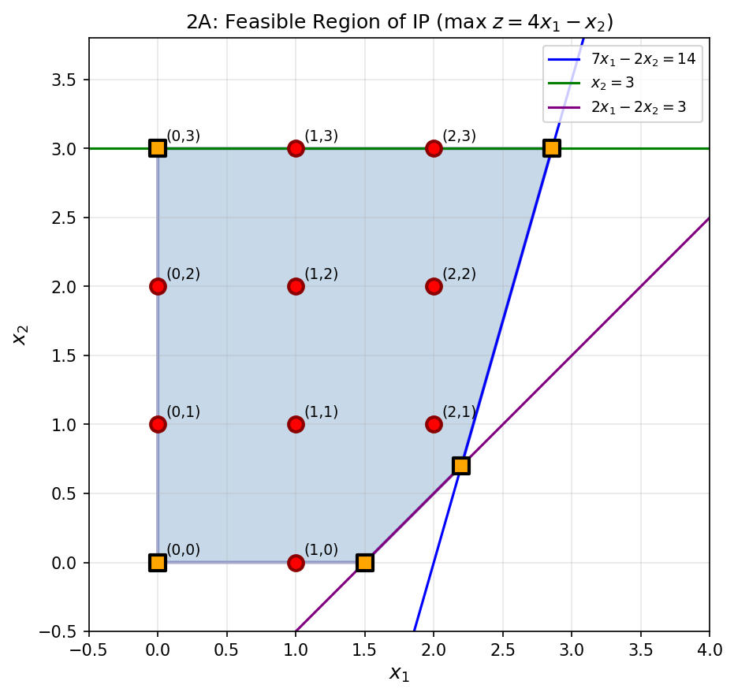
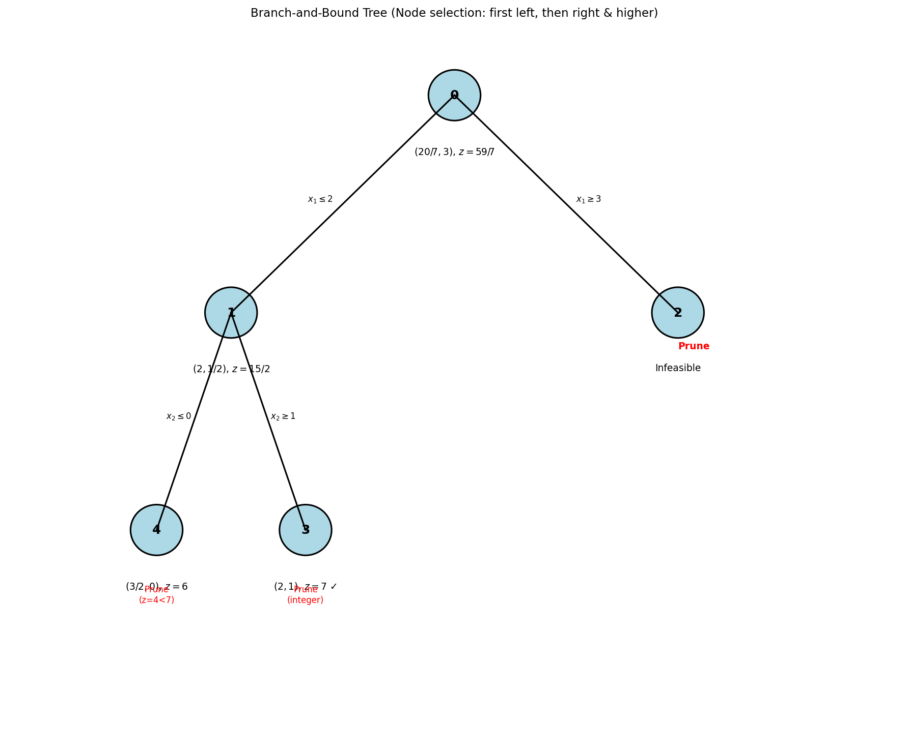
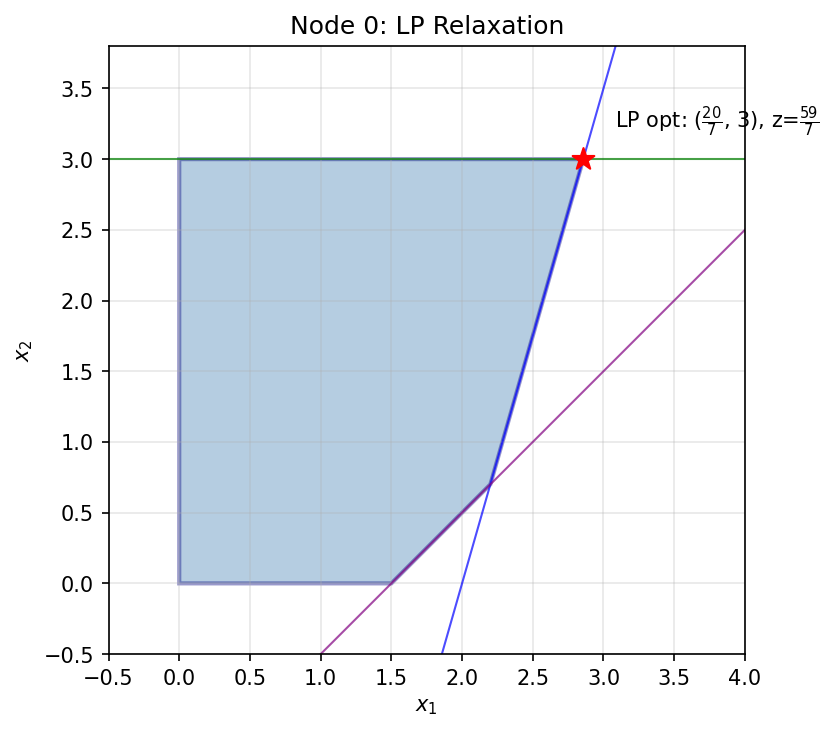
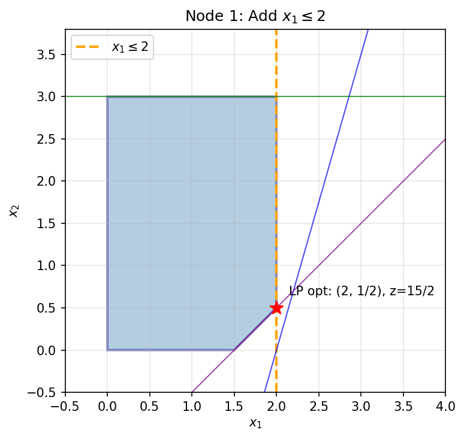
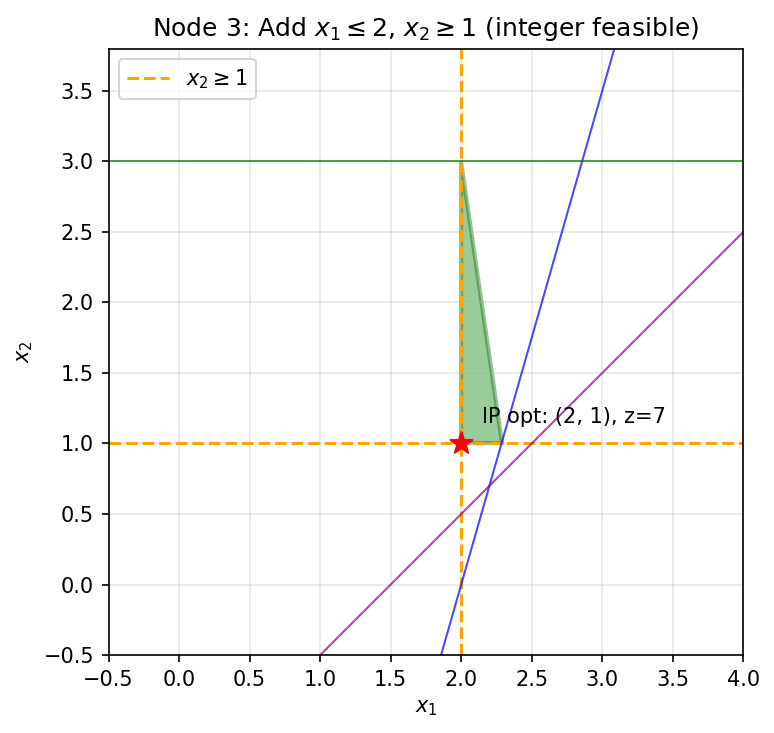
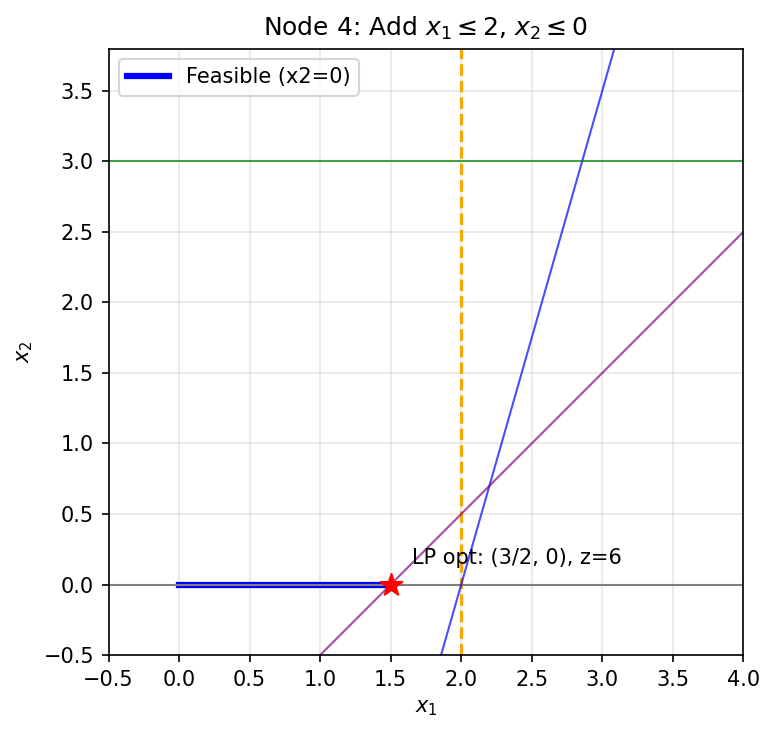

# IEOR 4004 - Assignment 3 Answers

**Instructor:** Dr. Yaren Bilge Kaya  
**Due:** 3/25/2026, 11:59 PM

---

## Question 1: Mobile C.A.R.E. Foundation (MCF) Case

**Context:** MCF’s mission is to control asthma in schoolchildren from low-income families in the greater Chicago area using mobile asthma vans. The task is to decide which schools each van serves, how many appointments to provide, and which patients to schedule for the next month.

---

### 1. Exploratory Data Analysis (EDA) *(5 points)*

EDA is performed via `python mcf_scheduler.py eda`. Summary:

**Patients per school (total):**

| School | 0 | 1 | 2 | 3 | 4 | 5 | 6 | 7 | 8 | 9 | 10 | 11 | 12 | 13 | 14 | 15 | 16 | 17 | 18 | 19 |
|--------|---|---|---|---|---|---|---|---|---|---|----|----|----|----|----|----|----|----|----|----|
| Count  | 34| 86| 48|114|142| 66| 32| 60|129|141| 93| 79|123| 81| 68| 33|113| 38| 36| 84|

Schools 4 and 9 have the most patients (142, 141).

**Patients by severity (aggregate):**

| Severity          | Count |
|-------------------|-------|
| SeverePersistent  | 87    |
| ModeratePersistent| 469   |
| MildPersistent    | 773   |
| MildIntermittent  | 271   |

**Other parameters:**
- **Van capacity:** ~300 patients/van/month (from historical APPS per van per day × ~20 weekdays)
- **School capacity:** 200 appointments/school/month (assumed from historical patterns)

---

### 2. Assumptions and Data Needs *(10 points)*

**Key data field interpretations (from Case_SCH#K_APPS):**
- **HOSP:** Hospitalizations since last appointment (per patient). HOSP > 0 → higher risk.
- **ER-VISIT:** ER visits since last appointment. ER > 0 → higher risk.
- **DAYS MISSED:** School days missed since last visit. Higher values → worse control, higher risk.
- **LAST DIAG / CURRENT DIAG:** Improved = better; Controlled = stable; Worsened = worse; Unchanged = no change. Worsened/Unchanged → elevated risk.
- **DUE BACK:** Next scheduled return date (set at current visit). Use for planning who should be seen.
- **LAST DUE BACK:** Previously scheduled return date. Use DUE BACK for scheduling.
- **NO SHOW (CURRENT DIAG):** Patient did not attend; scheduling such patients incurs an expected penalty.

**Distance (from School Locations):** Rectilinear: \( d = 0.1 \times (|x_1 - x_2| + |y_1 - y_2|) \) miles.

**Assumptions:**
- Two vans (Van 0, Van 1), weekdays only.
- Severity from data: SeverePersistent (4), ModeratePersistent (3), MildPersistent (2), MildIntermittent (1).
- Van capacity and variable cost per patient do not vary by severity.
- Each school’s capacity is the max appointments it can host per month.
- Each van can serve multiple schools; a school can be served by one or both vans.
- **Risk tier:** HOSP>0, ER>0, DAYS MISSED>2, LAST SEEN >90 days, or LAST DIAG ∈ {Worsened, Unchanged} → elevated risk.
- **NO SHOW:** Penalized in the objective to account for wasted slots.
- **Distance:** Penalized to favor assigning nearby schools to each van.

**Additional data desired:**
- Van working hours per day.
- Travel times (depot ↔ schools).
- Fixed time per school visit (setup, parking).
- Service time per patient (by severity).
- Probability of worsening if delayed to next month.
- Fixed and variable cost per van.

---

### 3. Modeling *(20 points)*

#### Sets

| Symbol | Description |
|--------|-------------|
| \( S \) | Set of schools, \( S = \{0, 1, \ldots, 19\} \) |
| \( V \) | Set of vans, \( V = \{0, 1\} \) |
| \( L \) | Set of severity levels: 1 = MildIntermittent, 2 = MildPersistent, 3 = ModeratePersistent, 4 = SeverePersistent |
| \( R \) | Set of risk tiers, \( R = \{\text{normal}, \text{elevated}\} \) — elevated if HOSP>0, ER-VISIT>0, high DAYS MISSED, LAST SEEN too long, or LAST DIAG ∈ {Worsened, Unchanged} |

#### Parameters

| Symbol | Description |
|--------|-------------|
| \( a_s \) | Appointment capacity at school \( s \in S \) |
| \( p_{s,\ell,r} \) | Number of patients at school \( s \), severity \( \ell \), risk tier \( r \) (preprocessed from Case_PatientList, Case_PatientSeverity, and APPS) |
| \( f_v \) | Fixed cost of using van \( v \in V \) |
| \( g_v \) | Variable cost per patient served by van \( v \in V \) |
| \( c_v \) | Capacity of van \( v \in V \) |
| \( T_v \) | Total working time for van \( v \in V \) |
| \( \alpha_{\ell,r} \) | Minimum fraction of patients in (severity \( \ell \), risk \( r \)) that must be served; e.g. \( \alpha_{4,\cdot} = 1 \), \( \alpha_{3,\text{elevated}} = 0.9 \), \( \alpha_{3,\text{normal}} = 0.7 \), \( \alpha_{2,\text{elevated}} = 0.6 \), \( \alpha_{2,\text{normal}} = 0.4 \), \( \alpha_{1,\cdot} = 0.3 \) |
| \( w_\ell \) | Weight for serving a patient of severity \( \ell \) (assumed: \( w_4 = 4 \), \( w_3 = 3 \), \( w_2 = 2 \), \( w_1 = 1 \); fixed, not changed by risk factors) |
| \( \psi_{s,\ell,r} \) | Fraction of patients in \( (s,\ell,r) \) with NO SHOW history (from APPS CURRENT DIAG) |
| \( \pi \) | Penalty per scheduled patient with NO SHOW history (expected cost of wasted slot) |
| \( \lambda \) | Scaling factor for objective: balance cost vs. weighted patient value (e.g. \( \lambda = 0.01 \)) |
| \( \mu \) | Weight for distance penalty; encourages shorter routes |
| \( d_s \) | Rectilinear distance from school \( s \) to centroid of all schools, in miles: \( 0.1 \times (|x_s - \bar{x}| + |y_s - \bar{y}|) \) |
| \( \tau_\ell, \tau_0 \) | Service time per patient (by severity), fixed time per school visit |

#### Decision Variables

| Symbol | Type | Description |
|--------|------|-------------|
| \( x_{s,v,\ell,r} \) | Non-negative integer | Number of patients in \( (s,\ell,r) \) served by van \( v \) |
| \( y_{s,v} \) | Binary | 1 if van \( v \) visits school \( s \), 0 otherwise |
| \( z_v \) | Binary | 1 if van \( v \) is used, 0 otherwise |

#### Objective Function

Minimize total cost and NO SHOW penalty, minus weighted patient value. Equivalently, maximize:

\[
\max \quad \sum w_\ell x_{s,v,\ell,r} - \lambda \left( \sum_v f_v z_v + \sum g_v x + \pi \sum \psi x + \mu \sum_{s,v} d_s \cdot y_{s,v} \right)
\]

So we maximize (weighted patients served) − λ × (fixed cost + variable cost + NO SHOW penalty + **distance penalty**).  
- **Distance:** \( d_s \) = rectilinear distance from school \( s \) to centroid (0.1 × (|Δx| + |Δy|) from School Locations). Penalizing \( \sum d_s \cdot y_{s,v} \) encourages assigning nearby schools to each van, reducing route length.  
- **Assumed weights:** \( w_4=4, w_3=3, w_2=2, w_1=1 \); \( \lambda = 0.01 \); \( \pi \) = NO SHOW penalty; \( \mu \) = distance weight (e.g. 0.5).

#### Constraints

1. **Van capacity:** \( \displaystyle \sum_{s,\ell,r} x_{s,v,\ell,r} \leq c_v \cdot z_v \quad \forall v \in V \)

2. **School capacity:** \( \displaystyle \sum_{v,\ell,r} x_{s,v,\ell,r} \leq a_s \quad \forall s \in S \)

3. **Patient availability:** \( \displaystyle \sum_v x_{s,v,\ell,r} \leq p_{s,\ell,r} \quad \forall s \in S, \, \ell \in L, \, r \in R \)

4. **Minimum service by severity and risk:**  
   At least fraction \( \alpha_{\ell,r} \) of patients in \( (s,\ell,r) \) must be served:
   \[
   \sum_v x_{s,v,\ell,r} \geq \alpha_{\ell,r} \cdot p_{s,\ell,r} \quad \forall s \in S, \, \ell \in L, \, r \in R
   \]
   In the implementation, only SeverePersistent (\( \alpha_{4,\cdot} = 1 \)) is enforced as a hard constraint to ensure feasibility; other levels are encouraged via the objective weights.

5. **Van use and assignment:**  
   \( \displaystyle \sum_{s,\ell,r} x_{s,v,\ell,r} \leq M z_v \),  
   \( \displaystyle \sum_{\ell,r} x_{s,v,\ell,r} \leq M y_{s,v} \quad \forall s, v \), with \( M \) large.

6. **Time constraint (simplified):**  
   Total service time + fixed visit time + travel time for van \( v \) ≤ \( T_v \).

#### Data Preprocessing (Risk Tiers and DUE BACK)

- **Risk tier** \( r(i) = \text{elevated} \) if any of: HOSP > 0, ER-VISIT > 0, DAYS MISSED above threshold (e.g. > 2), LAST SEEN beyond threshold (e.g. > 90 days), LAST DIAG ∈ {Worsened, Unchanged}.
- **\( p_{s,\ell,r} \)**: Count patients in school \( s \), severity \( \ell \) (from Case_PatientSeverity), risk \( r \) (from Case_SCH#K_APPS). Pool = all patients from Case_PatientList; DUE BACK can be used to prioritize.

---

### 4. Results *(20 points)*

The model is implemented in `mcf_scheduler.py` and solved with **Gurobi** (or PuLP/CBC). Run:

```bash
cd "Opt Models/Assignment/Assignment 3"
python mcf_scheduler.py          # uses Gurobi if available
python mcf_scheduler.py eda      # EDA only
python mcf_scheduler.py --gurobi # force Gurobi
python mcf_scheduler.py --pulp   # force PuLP/CBC
```

If Gurobi is in conda: `conda activate <env> && python mcf_scheduler.py`

**Optimal solution:** Status = Optimal, Objective ≈ 1770.5

**Schedule summary:**

| Van   | Schools visited                        | Total patients |
|-------|----------------------------------------|----------------|
| Van 0 | 0, 1, 2, 3, 7, 9, 12, 13, 16, 17      | 300            |
| Van 1 | 4, 5, 6, 8, 10, 11, 12, 14, 15, 18, 19| 300            |
| **Total** | Both vans used                      | **600**        |

**Van 0 (11 schools):** 0, 1, 2, 3, 7, 9, 12, 13, 16, 17. Breakdown by (severity, risk): SeverePersistent served in full; ModeratePersistent and MildPersistent dominate; elevated-risk patients prioritized within each group.

**Van 1 (11 schools):** 4, 5, 6, 8, 10, 11, 12, 14, 15, 18, 19. School 12 is shared by both vans.

**Interpretation:**
- All SeverePersistent patients are served (hard constraint).
- The distance penalty clusters schools geographically: Van 0 covers a tighter region; Van 1 covers another.
- Elevated-risk patients (HOSP, ER, worsened/unchanged diagnosis, etc.) are prioritized within each severity level.
- Specific patient IDs: run the script; `result["assigned_patients"]` lists Patient # for each van, chosen by priority from each (school, severity, risk) pool.

---

### 5. Objective Selection *(5 points)*

**Current objective:** Maximize (weighted patients served) − λ × (fixed cost + variable cost + NO SHOW penalty + **distance penalty**), with severity weights \( w_4 > w_3 > w_2 > w_1 \). Distance is penalized to favor assigning nearby schools to each van, reducing travel.

**Alternative formulations:**

| Objective | Description | Strengths | Weaknesses |
|-----------|-------------|-----------|------------|
| **Weighted by severity** (current) | \( \max \sum w_\ell x - \lambda \cdot \text{cost} \) | Considers different patient needs; ensures worst cases are covered; avoids neglecting severe patients | With weights, fewer total patients served; more complex to tune |
| **Total count only** | \( \max \sum x - \lambda \cdot \text{cost} \) (ignore severity) | Maximizes resource use in quantity; more people receive care; simple | No prioritization; cannot ensure severe patients are served first |
| **Per-school proportion** | \( \max \min_s \frac{\text{served}_s}{\text{total}_s} \) or \( \max \sum_s \frac{\text{served}_s}{\text{total}_s} \) | Fair across schools; improves school satisfaction; each school feels well served | Ignores severity; only reflects school-level performance, not overall social welfare |
| **Cost minimization** | \( \min \text{cost} \) s.t. minimum service constraints | Clear budget control | Does not maximize benefit beyond the minimum |

**Summary:**  
- **Current choice:** Balances cost with clinical priority and avoids worst outcomes.  
- **Count-only:** Maximizes reach and resource use but loses priority.  
- **Proportion-based:** Improves school satisfaction but loses severity and holistic welfare.  
- **Overall:** Weighted objectives better align with MCF’s goal of controlling asthma in vulnerable children; count and proportion are useful for reporting but weaker as main objectives.

---

## Question 2: Branch and Bound *(40 Points)*

To regenerate the figures, run:  
`python assignment3_q2_plots.py`  
Figures are saved to `q2_figures/`.

### 2.A. Feasible Region *(10 points)*

Consider the integer program:

\[
\begin{aligned}
\max \quad & z = 4x_1 - x_2 \\
\text{s.t.} \quad & 7x_1 - 2x_2 \leq 14 \\
& x_2 \leq 3 \\
& 2x_1 - 2x_2 \leq 3 \\
& x_1, x_2 \in \mathbb{Z}_+
\end{aligned}
\]

**Feasible region:** The LP relaxation forms a convex polygon. The constraints are:
- \( 7x_1 - 2x_2 \leq 14 \) (line through (2,0) and (20/7, 3))
- \( x_2 \leq 3 \) (horizontal line)
- \( 2x_1 - 2x_2 \leq 3 \) (line \( x_2 \geq x_1 - 1.5 \))

**Vertices of the LP feasible region:**
- (0, 0)
- (1.5, 0) — intersection of \( 2x_1 - 2x_2 = 3 \) with \( x_2 = 0 \)
- (11/5, 7/10) — intersection of \( 7x_1 - 2x_2 = 14 \) and \( 2x_1 - 2x_2 = 3 \)
- (20/7, 3) — intersection of \( 7x_1 - 2x_2 = 14 \) and \( x_2 = 3 \)
- (0, 3) — intersection of \( x_2 = 3 \) with \( x_1 = 0 \)

The **integer feasible points** are the lattice points inside or on the boundary of this polygon (e.g., (0,0), (1,0), (0,1), (1,1), (2,1), (0,2), (1,2), (2,2), (0,3), (1,3), (2,3); note (2,0) is infeasible since \(2\cdot 2 - 0 = 4 > 3\)).



---

### 2.B. Branch-and-Bound Solution *(30 points)*

**Branch-and-Bound (B&B)** is a tree-based algorithm for solving integer programs:

1. **Root:** Solve the LP relaxation (drop integer constraints). If the solution is integer, stop.
2. **Branch:** Pick a fractional variable \(x_i\); create two subproblems: add \(x_i \leq \lfloor x_i^* \rfloor\) (left) or \(x_i \geq \lceil x_i^* \rceil\) (right).
3. **Bound:** Each node's LP optimum gives an upper bound (for max). If the bound \(\leq\) current best integer solution, prune.
4. **Prune:** Nodes are pruned if infeasible, integer feasible, or dominated by the incumbent.

Each node in the tree corresponds to one **subproblem** (LP with added branching constraints).

---

**LP relaxation:** Optimal solution at vertex (20/7, 3) with \( z = 4 \cdot \frac{20}{7} - 3 = \frac{59}{7} \approx 8.43 \).  
Variable \( x_1 = 20/7 \) is fractional → branch on \( x_1 \).

**Node selection rule** (per assignment):
- **First branch:** choose the **left-most** branch (\( x_1 \leq 2 \)).
- **Thereafter:** always choose the **right-most** branch (if one exists), and prefer **higher** branches to **lower** branches.

Here, "right" = constraint \(x_i \geq \lceil x_i^* \rceil\) (upper range); "left" = \(x_i \leq \lfloor x_i^* \rfloor\); "higher" = upper branch.

#### Branch-and-Bound Tree

**Node 0 (Root):** LP optimum (20/7, 3), \( z = 59/7 \). Branch on \( x_1 \).

**Left branch:** \( x_1 \leq 2 \)  
**Right branch:** \( x_1 \geq 3 \)



---

**Node 1 (Left of root):** Add \( x_1 \leq 2 \).

Solve LP with \( x_1 \leq 2 \). New optimum at (2, 1/2), \( z = 4(2) - 1/2 = 15/2 = 7.5 \).  
\( x_2 \) fractional → branch on \( x_2 \).

- Left: \( x_2 \leq 0 \)  
- Right: \( x_2 \geq 1 \)

By the rule (right-most, prefer higher), explore **\( x_2 \geq 1 \)** first.

---

**Node 2 (Right of root):** Add \( x_1 \geq 3 \).

With \( x_1 \geq 3 \), check feasibility: \( 7 \cdot 3 - 2x_2 \leq 14 \Rightarrow x_2 \geq 7/2 \), but \( x_2 \leq 3 \).  
→ **Infeasible.** Prune.

---

**Node 3 (Right of Node 1, \( x_2 \geq 1 \)):** Add \( x_2 \geq 1 \) to Node 1’s constraints.

Optimum at (2, 1), \( z = 7 \). All variables integer → **feasible solution.**  
Incumbent: \( (x_1, x_2) = (2, 1) \), \( z^* = 7 \). Prune (integer solution found).

---

**Node 4 (Left of Node 1, \( x_2 \leq 0 \)):** Add \( x_2 \leq 0 \) to Node 1’s constraints.

Then \( x_2 = 0 \). From \( 2x_1 - 0 \leq 3 \), \( x_1 \leq 1.5 \). Optimum at (3/2, 0), \( z = 6 \).  
\( x_1 \) fractional → branch on \( x_1 \): \( x_1 \leq 1 \) or \( x_1 \geq 2 \).  
- \( x_1 \geq 2 \): Contradicts \( x_1 \leq 1.5 \) → **infeasible**. Prune.  
- \( x_1 \leq 1 \): Integer solution (1, 0), \( z = 4 < 7 \). Worse than incumbent; prune by bound.

---

#### Feasible Region Changes at B&B Nodes

  
  
  


---

**Exploration order** (depth-first, per rule): 0 → 1 (first: left \(x_1 \leq 2\)) → 3 (right & higher: \(x_2 \geq 1\)) → 4 (left: \(x_2 \leq 0\)) → 2 (right of root).

**Optimal solution:** \( x_1^* = 2 \), \( x_2^* = 1 \), \( z^* = 7 \).
