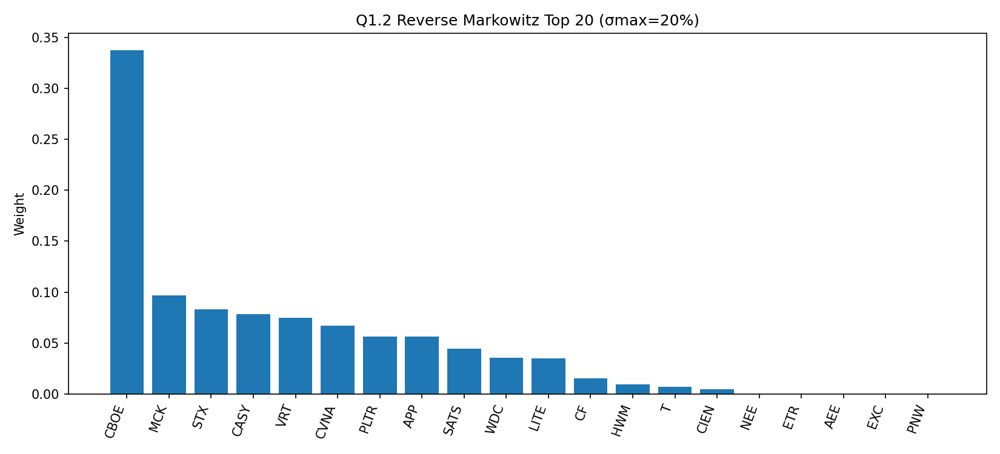
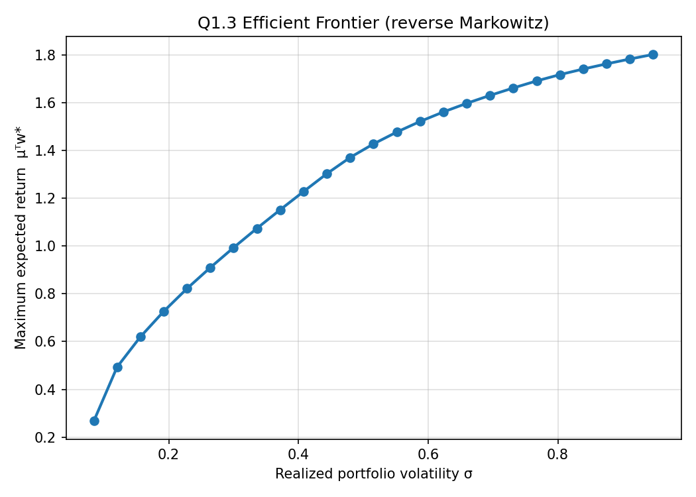
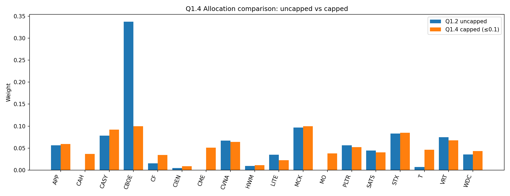

# Question 1 — Reverse Markowitz Portfolio

## 1.1  Algebraic formulation

**Sets / indices.**  $i \in \{1,\dots,n\}$ indexes the $n$ candidate stocks.

**Decision variables.**  $w_i \in \mathbb{R}$ — fraction of wealth invested in asset $i$.

**Parameters.**

- $\mu \in \mathbb{R}^n$: vector of expected (annualized) returns of the assets, estimated from historical daily simple returns by $\hat{\mu}_i = 252 \cdot \overline{r_i}$.
- $\Sigma \in \mathbb{R}^{n \times n}$: symmetric positive semi-definite covariance matrix of asset returns, $\hat{\Sigma} = 252 \cdot \mathrm{Cov}(r)$.
- $\sigma^{2}_{\max}$: maximum allowable portfolio variance (risk threshold).

**Model (QCQP).**
$$
\boxed{\;
\begin{aligned}
\max_{w \in \mathbb{R}^n} \quad & \mu^{\top} w \\
\text{s.t.} \quad & w^{\top} \Sigma w \;\le\; \sigma^{2}_{\max} \quad \text{(risk constraint)}\\
& \mathbf{1}^{\top} w \;=\; 1 \quad \text{(full investment)} \\
& w_i \;\ge\; 0 \quad \forall \, i \quad \text{(no short selling)}
\end{aligned}\;}
$$

The objective is linear and the only nonlinear element is the convex quadratic risk constraint, so this is a convex QCQP and is solved natively by Gurobi.

**Relation to the classical Markowitz model.**  The class problem
$\min w^{\top}\Sigma w$ s.t. $\mu^{\top} w \ge R_{\text{target}}$
and the present formulation are *dual parametrizations* of the same Pareto frontier: sweeping $\sigma^{2}_{\max}$ here traces the same efficient frontier as sweeping $R_{\text{target}}$ there.

---

## 1.2  Portfolio construction

**Data.**  I use the current S\&P 500 constituent list from a public constituents CSV mirror (Wikipedia may return 403), then download daily adjusted close prices from **2023-04-23 to 2026-04-23** (three trading years) via `yfinance`.

After dropping tickers with incomplete / invalid histories and aligning trading days, I retain **$n=498$** assets in this run. Daily simple returns are computed by `pct_change()`; annualized $\hat{\mu}$ and $\hat{\Sigma}$ are computed as $\hat{\mu}=252\cdot \overline r$ and $\hat{\Sigma}=252\cdot \mathrm{Cov}(r)$.

**Risk threshold.**  I pick $\sigma_{\max} = 20\%$ annual volatility (so $\sigma_{\max}^{2}=0.04$), corresponding to roughly the long-run S&P 500 realised volatility.

**Solver.**  I attempt to solve with Gurobi first; however, for the full S\&P 500 universe the model exceeds the size limit of the installed license, so I solve the convex QCQP with `cvxpy` (SCS backend).

**Result (see `q1_2_allocation.png`, `q1_results.txt`).**  The optimal portfolio concentrates in a handful of high estimated return / risk names in the 2023–2026 sample — a typical artifact of the unconstrained long-only Markowitz solution: estimation noise in $\hat{\mu}$ leads to corner solutions where weight piles into a small set of stocks.

For $\sigma_{\max}=20\%$ (annual vol), the optimizer achieves:

- Expected annual return: **0.7480**
- Realized portfolio variance: **0.040000** (std $=0.2000$)
- Non-trivial holdings ($w_i>10^{-4}$): **15**

Top holdings (weights): CBOE 0.3377, MCK 0.0965, STX 0.0831, CASY 0.0782, VRT 0.0745, CVNA 0.0668, PLTR 0.0566, APP 0.0563, SATS 0.0443, WDC 0.0352.

{width=85%}

---

## 1.3  Efficient frontier sensitivity

I re-solve the QCQP for $\sigma_{\max}$ on a grid spanning the feasible region (starting just above the minimum-variance volatility) and plot the achieved expected return against the realized portfolio volatility (`q1_3_efficient_frontier.png`).

**Insight.**  The frontier is monotone increasing and concave: tightening the risk budget forces a roughly linear give-up in expected return at high $\sigma$, but the marginal cost steepens sharply once $\sigma_{\max}$ falls below the minimum-variance level — the budget constraint $\mathbf{1}^{\top}w=1$ together with positivity binds, and further risk reduction is impossible. The slope of the frontier at any point is the local *marginal Sharpe ratio* of taking on one more unit of risk; risk-averse investors operate where this slope is large, return-seekers where it flattens.

{width=70%}

---

## 1.4  Practical refinement: per-asset weight cap

**Modification.**  I add the constraint
$$
w_i \;\le\; \overline{w} = 0.10 \quad \forall i,
$$
i.e. no single name receives more than 10% of the portfolio. This addresses the diversification concern raised in the question (the unconstrained portfolio concentrates heavily in a handful of stocks).

**Results (`q1_4_comparison.png`, `q1_results.txt`).**  For $\sigma_{\max}=20\%$ with $\overline w=10\%$, the optimizer achieves:

- Expected annual return: **0.7309** (uncapped: 0.7480 — a give-up of $\approx 1.7$ pp annualized).
- Realized variance: **0.040000** (std $=0.2000$) — the risk constraint is still binding, identical to the uncapped case.
- Non-trivial holdings ($w_i>10^{-4}$): **20** (uncapped: 15).

**How the portfolio changed.**  In the uncapped solution, the optimizer concentrates heavily in the top name and a small set of high-return names. The 10% cap forces the largest position down to exactly 10% and reallocates the displaced weight into additional names, lifting the count of non-trivial holdings from 15 to 20.

**Trade-off.**  I give up about $1.7$ pp of annualized expected return in exchange for (i) much better diversification — no single name dominates — and (ii) substantially better expected out-of-sample robustness, since the uncapped solution concentrates in the names with the largest *estimated* $\hat\mu$, which suffer the most from estimation noise. The risk budget is fully used in both cases, so the cost is borne entirely by the return side rather than by an over-conservative variance.

{width=95%}

\newpage

# Question 2 — KKT conditions

I solve
$$
\min_{x_1,x_2}\; (x_1-2)^2 + (x_2-4)^2
\quad\text{s.t.}\quad -x_1+x_2 = 1,\; x_1+x_2 \le 4.
$$

**Lagrangian** (equality multiplier $\lambda$, inequality multiplier $\mu \ge 0$):
$$
\mathcal{L}(x,\lambda,\mu) = (x_1-2)^2 + (x_2-4)^2 + \lambda(-x_1+x_2-1) + \mu(x_1+x_2-4).
$$

**KKT conditions.**

1. *Stationarity* $\nabla_x \mathcal{L} = 0$:
   $$2(x_1-2)-\lambda+\mu = 0, \qquad 2(x_2-4)+\lambda+\mu = 0.$$
2. *Primal feasibility*: $-x_1+x_2 = 1, \; x_1+x_2 \le 4$.
3. *Dual feasibility*: $\mu \ge 0$.
4. *Complementary slackness*: $\mu(x_1+x_2-4) = 0$.

**Case A — inequality slack ($\mu = 0$).**  Stationarity and the equality give $x_1=2.5,\, x_2=3.5$, with $\lambda=1$.  But $x_1+x_2 = 6 > 4$, violating primal feasibility. **Reject.**

**Case B — inequality active ($x_1+x_2 = 4$).**  Combining with $-x_1+x_2 = 1$ yields
$$x_1^* = 1.5,\quad x_2^* = 2.5.$$
Plugging into stationarity:
$$\lambda - \mu = -1, \qquad \lambda + \mu = 3 \;\;\Longrightarrow\;\; \lambda^* = 1,\; \mu^* = 2.$$
Dual feasibility $\mu^* = 2 \ge 0$ holds. \textbf{(OK)}

**Optimal solution.**
$$
\boxed{\; x^* = (1.5,\, 2.5),\quad \lambda^* = 1,\quad \mu^* = 2,\quad f(x^*) = 0.25 + 2.25 = 2.5. \;}
$$

*Geometric interpretation.* The unconstrained minimum is at $(2,4)$. The equality $-x_1+x_2 = 1$ restricts the search to a line whose closest point to $(2,4)$ is $(2.5, 3.5)$; that point sits outside the half-plane $x_1+x_2 \le 4$, so the optimum is pushed to the corner where both active constraints intersect: $(1.5,2.5)$.

\newpage

# Question 3 — Traffic congestion QP

## 3.1  Formulation

I solve the system optimum where total congestion cost is minimized.

**Edges and parameters** (read from the network diagram):
$$
\begin{aligned}
E = \{ &(1,2)_{R=2},\;(1,3)_{R=5},\;(2,3)_{R=1},\;(2,4)_{R=3},\\
       &(3,4)_{R=2},\;(3,5)_{R=4},\;(4,5)_{R=2},\;(4,6)_{R=6},\;(5,6)_{R=3} \}.
\end{aligned}
$$

**Decision variables.**  $x_{ij} \ge 0$, the number of vehicles routed on edge $(i,j) \in E$.

**Objective.**
$$\min \; \sum_{(i,j)\in E} R_{ij}\, x_{ij}^{2}.$$

**Constraints (flow conservation).**

| Node | Constraint |
|---|---|
| 1 (source) | $x_{12} + x_{13} = 150$ |
| 2 | $x_{12} - x_{23} - x_{24} = 0$ |
| 3 | $x_{13} + x_{23} - x_{34} - x_{35} = 0$ |
| 4 | $x_{24} + x_{34} - x_{45} - x_{46} = 0$ |
| 5 | $x_{35} + x_{45} - x_{56} = 0$ |
| 6 (sink) | $x_{46} + x_{56} = 150$ |

Since the cost is strictly convex in each $x_{ij}$ and the constraints are linear, this is a convex QP with a unique global optimum.

## 3.2  LP file and Gurobi solution

The LP file `q3_congestion.lp` contains the full QP in Gurobi's standard quadratic block format (the $[\cdots]/2$ syntax encodes $\tfrac12 x^{\top}Qx$, so each diagonal entry is $2R_{ij}$). The companion script `q3_congestion_solve.py` reads this file and solves it with `gurobipy`.

**Optimal flows** (verified by solving the KKT system in closed form using $2 R_{ij} x_{ij} = \pi_i - \pi_j$ with node potentials $\pi$, and confirmed all $x_{ij} \ge 0$ so the interior KKT solution is the global optimum):

| Edge | $R_{ij}$ | $x_{ij}^*$ | Edge | $R_{ij}$ | $x_{ij}^*$ |
|:---:|:---:|---:|:---:|:---:|---:|
| (1,2) | 2 | **100.111** | (3,5) | 4 | **47.386** |
| (1,3) | 5 | **49.889**  | (4,5) | 2 | **43.048** |
| (2,3) | 1 | **49.221**  | (4,6) | 6 | **59.566** |
| (2,4) | 3 | **50.890**  | (5,6) | 3 | **90.434** |
| (3,4) | 2 | **51.724**  |       |   |             |

Conservation checks: $x_{12}+x_{13} = 150.000$ at node 1 and $x_{46}+x_{56} = 150.000$ at node 6; all intermediate net flows are $0$ to numerical precision.

**Total minimized congestion cost.**
$$
\sum_{(i,j)\in E} R_{ij}\, (x_{ij}^*)^{2} \;=\; \boxed{\,106{,}543.38\,}.
$$
